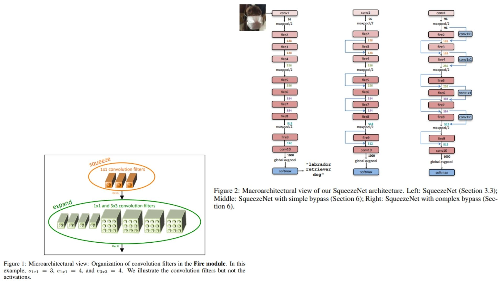

# 🌺 SqueezeNet-Replication PyTorch Implementation

This repository contains a replication of **SqueezeNet** using PyTorch. The goal is to build a **lightweight CNN backbone** with **Fire modules** (squeeze + expand) for efficient inference and small model size.

- Implemented **SqueezeNet** with Fire modules (1×1 squeeze + 1×1 & 3×3 expand).  
- Architecture:  
**Conv → FireModule → ... → FireModule → AvgPool → Flatten → FC**  
**Paper**: [SqueezeNet: AlexNet-level accuracy with 50x fewer parameters](https://arxiv.org/abs/1602.07360)

---

## 🖼 Overview – SqueezeNet with Fire Modules

  

**Figure 1 & Figure 2:** Sketch of SqueezeNet stages. Each stage contains multiple Fire modules. Squeeze layers reduce the number of input channels, and expand layers (1×1 & 3×3 convs) increase representational capacity.  

> **Model overview:**  
> SqueezeNet is a small, fully convolutional network designed for **minimal parameters** while retaining **AlexNet-level accuracy**. The model balances
> **compact size, speed, and efficiency** using fire modules and optional bypass connections for improved gradient flow.

---

## 🏗 Project Structure

```bash
SqueezeNet-Replication/
│
├── src/
│   ├── layers/
│   │   ├── conv_layer.py           # Standart conv layer (1x1, 3x3)
│   │   ├── fire_module.py          # Fire module (squeeze + expand)
│   │   ├── pool_layers/
│   │   │   ├── maxpool_layer.py
│   │   │   └── avgpool_layer.py
│   │   └── flatten_layer.py
│   │
│   ├── model/
│   │   └── squeezenet_model.py     # SqueezeNet assembly with Fire modules
│   │
│   └── config.py
├── images/
│   └── figmix.jpg
│ 
├── requirements.txt
└── README.md

```
---

## 🔗 Feedback

For questions or feedback, contact: [barkin.adiguzel@gmail.com](mailto:barkin.adiguzel@gmail.com)
